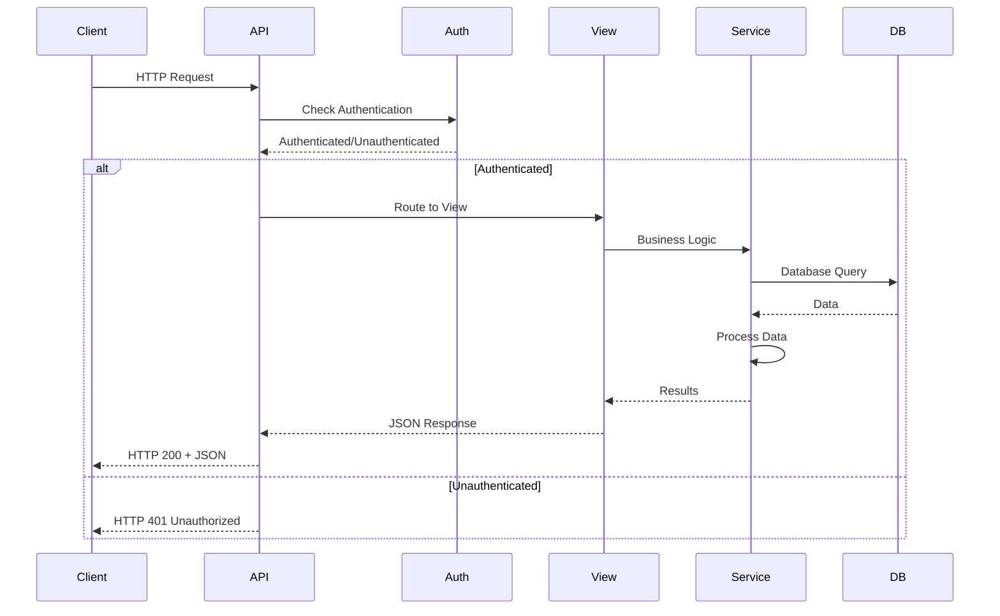
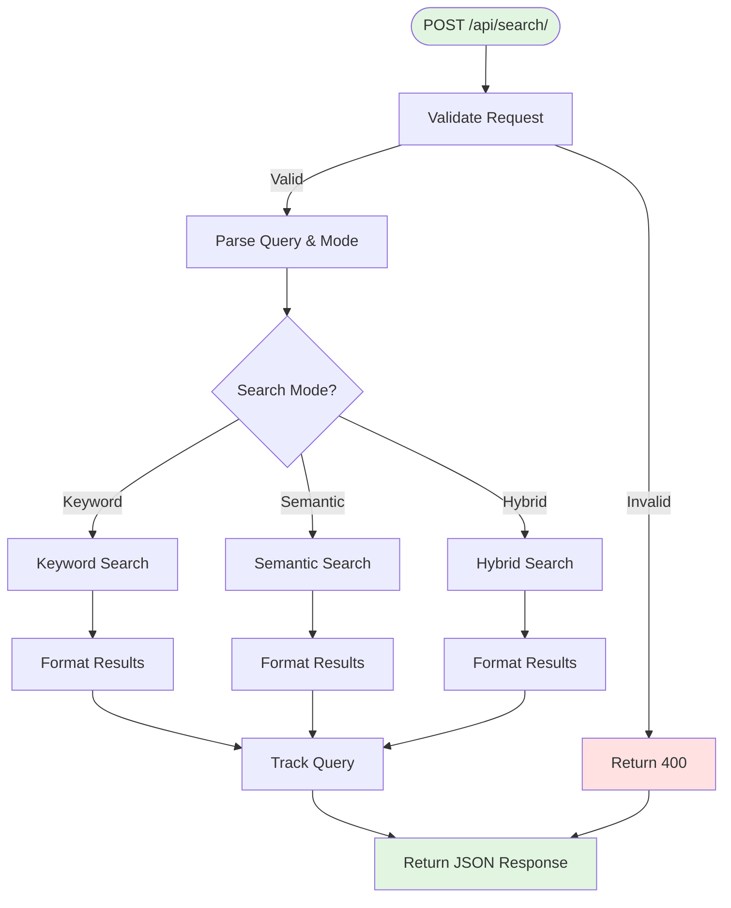
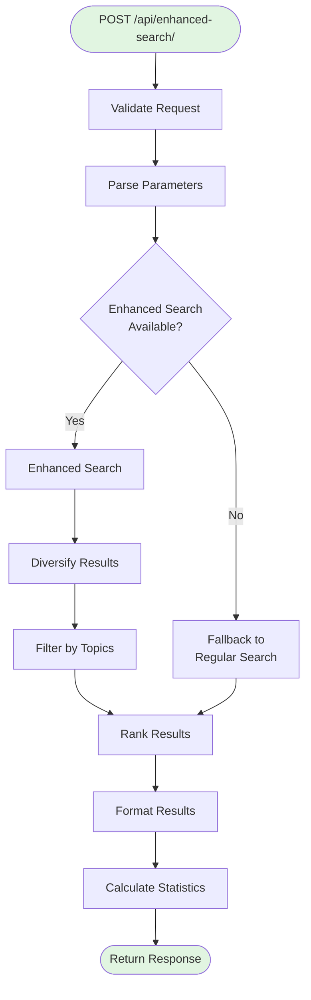
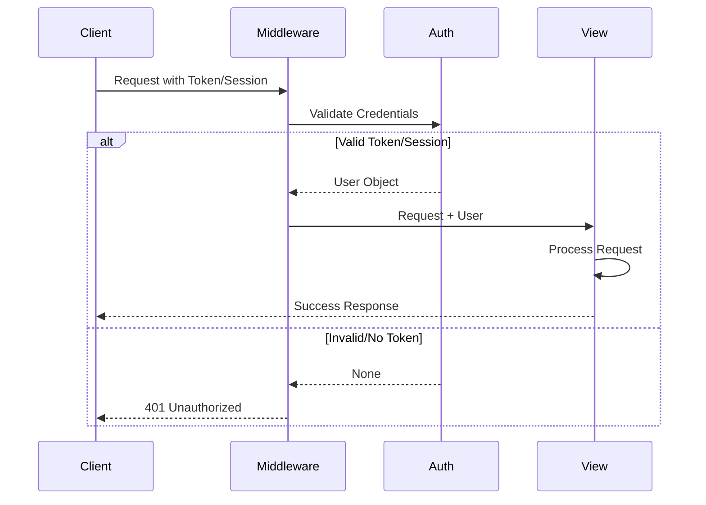
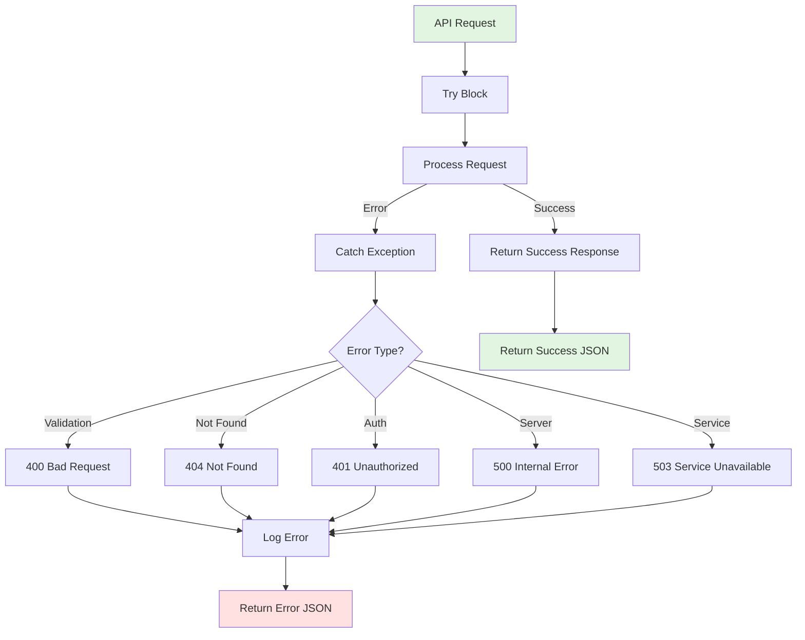

# API Endpoints Structure

## API Endpoint Organization

```mermaid
graph TB
    API["API Base: /api/"]
    
    API --> SearchGroup[Search Endpoints]
    API --> VideoGroup[Video Endpoints]
    API --> AdminGroup[Admin Endpoints]
    API --> HealthGroup[Health Endpoints]
    API --> TeamsGroup[Teams Endpoints]
    API --> HybridGroup[Hybrid Endpoints]
    API --> DocsGroup[Documentation]
    
    SearchGroup --> SearchBasic["POST /api/search/<br/>Basic search"]
    SearchGroup --> SearchEnhanced["POST /api/enhanced-search/<br/>Enhanced search"]
    SearchGroup --> SearchAdvanced["POST /api/advanced-search/<br/>Advanced search"]
    SearchGroup --> RAG["POST /api/rag-qa/<br/>RAG Q&A"]
    
    VideoGroup --> VideoDetails["GET /api/video/&lt;job_id&gt;/<br/>Get video details"]
    VideoGroup --> VideoUpdate["POST /api/video/&lt;job_id&gt;/update-metadata/<br/>Update metadata"]
    VideoGroup --> VideoFile["GET /video-file/&lt;job_id&gt;/<br/>Serve video file"]
    
    AdminGroup --> SearchStatus["GET /api/search-status/<br/>Search engine status"]
    AdminGroup --> DetailedStats["GET /api/detailed-stats/<br/>System statistics"]
    AdminGroup --> PendingJobs["GET /api/pending-jobs/<br/>Pending jobs"]
    AdminGroup --> RebuildIndex["POST /api/rebuild-search-index/<br/>Rebuild index"]
    AdminGroup --> RebuildEnhanced["POST /api/rebuild-enhanced-search-index/<br/>Rebuild enhanced index"]
    AdminGroup --> CleanupYouTube["POST /api/cleanup-youtube/<br/>Cleanup YouTube files"]
    AdminGroup --> ProcessJob["POST /api/process-job/<br/>Process job"]
    
    HealthGroup --> HealthCheck["GET /api/health/<br/>Health check"]
    HealthGroup --> HealthBasic["GET /health/<br/>Basic health"]
    
    TeamsGroup --> TeamsSummary["GET /api/teams/summary/<br/>Teams summary"]
    TeamsGroup --> TeamsList["GET /api/teams/<br/>Teams list"]
    
    HybridGroup --> HybridStatus["GET /api/hybrid/status/<br/>Hybrid status"]
    HybridGroup --> HybridProcessed["GET /api/hybrid/processed/<br/>Processed batches"]
    HybridGroup --> HybridProcess["POST /api/hybrid/process/<br/>Process batch"]
    
    DocsGroup --> Schema["GET /api/schema/<br/>OpenAPI schema"]
    DocsGroup --> Swagger["GET /api/docs/<br/>Swagger UI"]
    DocsGroup --> Redoc["GET /api/redoc/<br/>ReDoc UI"]
    
    style API fill:#4CAF50,color:#fff
    style SearchGroup fill:#2196F3,color:#fff
    style VideoGroup fill:#FF9800,color:#fff
    style AdminGroup fill:#9C27B0,color:#fff
    style HealthGroup fill:#F44336,color:#fff
    style TeamsGroup fill:#00BCD4,color:#fff
    style HybridGroup fill:#795548,color:#fff
    style DocsGroup fill:#607D8B,color:#fff
```

## Request/Response Flow

```mermaid
sequenceDiagram
    participant Client
    participant API
    participant Auth
    participant View
    participant Service
    participant DB
    
    Client->>API: HTTP Request
    API->>Auth: Check Authentication
    Auth-->>API: Authenticated/Unauthenticated
    
    alt Authenticated
        API->>View: Route to View
        View->>Service: Business Logic
        Service->>DB: Database Query
        DB-->>Service: Data
        Service->>Service: Process Data
        Service-->>View: Results
        View-->>API: JSON Response
        API-->>Client: HTTP 200 + JSON
    else Unauthenticated
        API-->>Client: HTTP 401 Unauthorized
    end
```

## Search API Flow

```mermaid
flowchart TD
    Start([POST /api/search/]) --> Validate[Validate Request]
    Validate -->|Invalid| Error[Return 400]
    Validate -->|Valid| Parse[Parse Query & Mode]
    Parse --> CheckMode{Search Mode?}
    
    CheckMode -->|Keyword| Keyword[Keyword Search]
    CheckMode -->|Semantic| Semantic[Semantic Search]
    CheckMode -->|Hybrid| Hybrid[Hybrid Search]
    
    Keyword --> Format1[Format Results]
    Semantic --> Format2[Format Results]
    Hybrid --> Format3[Format Results]
    
    Format1 --> Track[Track Query]
    Format2 --> Track
    Format3 --> Track
    
    Track --> Return[Return JSON Response]
    Error --> Return
    
    style Start fill:#e1f5e1
    style Return fill:#e1f5e1
    style Error fill:#ffe1e1
```

## Enhanced Search API Flow

```mermaid
flowchart TD
    Start([POST /api/enhanced-search/]) --> Validate[Validate Request]
    Validate --> Parse[Parse Parameters]
    Parse --> CheckAvailable{Enhanced Search<br/>Available?}
    
    CheckAvailable -->|Yes| Enhanced[Enhanced Search]
    CheckAvailable -->|No| Fallback[Fallback to<br/>Regular Search]
    
    Enhanced --> Diversify[Diversify Results]
    Diversify --> Filter[Filter by Topics]
    Filter --> Rank[Rank Results]
    
    Fallback --> Rank
    
    Rank --> Format[Format Results]
    Format --> Stats[Calculate Statistics]
    Stats --> Return([Return Response])
    
    style Start fill:#e1f5e1
    style Return fill:#e1f5e1
```

## API Authentication Flow

```mermaid
sequenceDiagram
    participant Client
    participant Middleware
    participant Auth
    participant View
    
    Client->>Middleware: Request with Token/Session
    Middleware->>Auth: Validate Credentials
    
    alt Valid Token/Session
        Auth-->>Middleware: User Object
        Middleware->>View: Request + User
        View->>View: Process Request
        View-->>Client: Success Response
    else Invalid/No Token
        Auth-->>Middleware: None
        Middleware-->>Client: 401 Unauthorized
    end
```

## Error Handling Flow

```mermaid
flowchart TD
    Request[API Request] --> Try[Try Block]
    Try --> Process[Process Request]
    Process -->|Success| Success[Return Success Response]
    Process -->|Error| Catch[Catch Exception]
    
    Catch --> CheckType{Error Type?}
    
    CheckType -->|Validation| Validation[400 Bad Request]
    CheckType -->|Not Found| NotFound[404 Not Found]
    CheckType -->|Auth| Auth[401 Unauthorized]
    CheckType -->|Server| Server[500 Internal Error]
    CheckType -->|Service| Service[503 Service Unavailable]
    
    Validation --> Log[Log Error]
    NotFound --> Log
    Auth --> Log
    Server --> Log
    Service --> Log
    
    Log --> ErrorResponse[Return Error JSON]
    Success --> SuccessResponse[Return Success JSON]
    
    style Request fill:#e1f5e1
    style SuccessResponse fill:#e1f5e1
    style ErrorResponse fill:#ffe1e1
```

