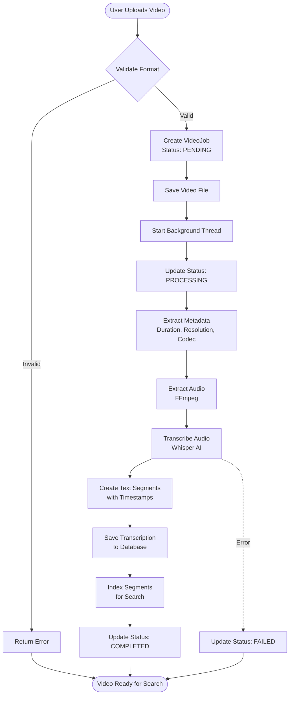
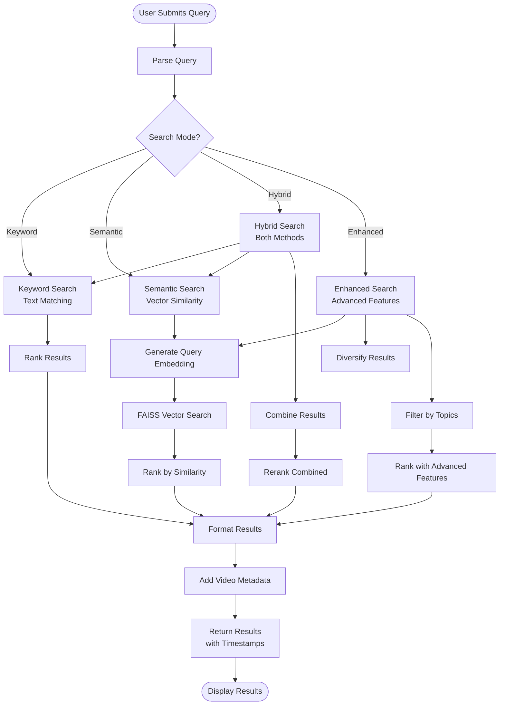
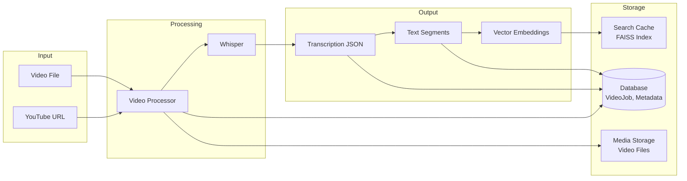
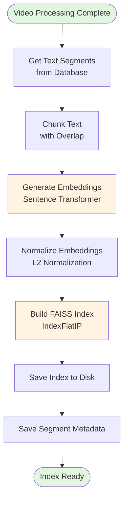

# Data Flow Diagrams

## Video Processing Pipeline

```mermaid
flowchart TD
    Start([User Uploads Video]) --> Validate{Validate Format}
    Validate -->|Invalid| Error1[Return Error]
    Validate -->|Valid| CreateJob[Create VideoJob<br/>Status: PENDING]
    
    CreateJob --> SaveFile[Save Video File]
    SaveFile --> StartThread[Start Background Thread]
    
    StartThread --> UpdateStatus1[Update Status: PROCESSING]
    UpdateStatus1 --> ExtractMeta[Extract Metadata<br/>Duration, Resolution, Codec]
    
    ExtractMeta --> ExtractAudio[Extract Audio<br/>FFmpeg]
    ExtractAudio --> Transcribe[Transcribe Audio<br/>Whisper AI]
    
    Transcribe --> CreateSegments[Create Text Segments<br/>with Timestamps]
    CreateSegments --> SaveTranscription[Save Transcription<br/>to Database]
    
    SaveTranscription --> IndexSearch[Index Segments<br/>for Search]
    IndexSearch --> UpdateStatus2[Update Status: COMPLETED]
    
    UpdateStatus2 --> End([Video Ready for Search])
    
    Error1 --> End
    Transcribe -.->|Error| UpdateFailed[Update Status: FAILED]
    UpdateFailed --> End
```

## Search Query Flow

```mermaid
flowchart TD
    Start([User Submits Query]) --> ParseQuery[Parse Query]
    ParseQuery --> CheckMode{Search Mode?}
    
    CheckMode -->|Keyword| KeywordSearch[Keyword Search<br/>Text Matching]
    CheckMode -->|Semantic| SemanticSearch[Semantic Search<br/>Vector Similarity]
    CheckMode -->|Hybrid| HybridSearch[Hybrid Search<br/>Both Methods]
    CheckMode -->|Enhanced| EnhancedSearch[Enhanced Search<br/>Advanced Features]
    
    KeywordSearch --> Rank1[Rank Results]
    SemanticSearch --> GenerateEmbedding[Generate Query Embedding]
    GenerateEmbedding --> FAISSSearch[FAISS Vector Search]
    FAISSSearch --> Rank2[Rank by Similarity]
    
    HybridSearch --> KeywordSearch
    HybridSearch --> SemanticSearch
    HybridSearch --> Combine[Combine Results]
    Combine --> Rank3[Rerank Combined]
    
    EnhancedSearch --> GenerateEmbedding
    EnhancedSearch --> Diversify[Diversify Results]
    EnhancedSearch --> FilterTopics[Filter by Topics]
    FilterTopics --> Rank4[Rank with Advanced Features]
    
    Rank1 --> FormatResults[Format Results]
    Rank2 --> FormatResults
    Rank3 --> FormatResults
    Rank4 --> FormatResults
    
    FormatResults --> AddMetadata[Add Video Metadata]
    AddMetadata --> ReturnResults[Return Results<br/>with Timestamps]
    ReturnResults --> End([Display Results])
```

## Data Storage Flow

```mermaid
flowchart LR
    subgraph "Input"
        VideoFile[Video File]
        YouTubeURL[YouTube URL]
    end
    
    subgraph "Processing"
        Process[Video Processor]
        Transcribe[Whisper]
    end
    
    subgraph "Storage"
        DB[(Database<br/>VideoJob, Metadata)]
        Media[Media Storage<br/>Video Files]
        Cache[Search Cache<br/>FAISS Index]
    end
    
    subgraph "Output"
        Transcription[Transcription JSON]
        Segments[Text Segments]
        Embeddings[Vector Embeddings]
    end
    
    VideoFile --> Process
    YouTubeURL --> Process
    Process --> Transcribe
    Transcribe --> Transcription
    Transcription --> Segments
    Segments --> Embeddings
    
    Process --> DB
    Process --> Media
    Transcription --> DB
    Segments --> DB
    Embeddings --> Cache
```

## Search Index Building Flow

```mermaid
flowchart TD
    Start([Video Processing Complete]) --> GetSegments[Get Text Segments<br/>from Database]
    GetSegments --> ChunkText[Chunk Text<br/>with Overlap]
    ChunkText --> GenerateEmbeddings[Generate Embeddings<br/>Sentence Transformer]
    GenerateEmbeddings --> Normalize[Normalize Embeddings<br/>L2 Normalization]
    Normalize --> BuildIndex[Build FAISS Index<br/>IndexFlatIP]
    BuildIndex --> SaveIndex[Save Index to Disk]
    SaveIndex --> SaveMetadata[Save Segment Metadata]
    SaveMetadata --> End([Index Ready])
    
    style Start fill:#e1f5e1
    style End fill:#e1f5e1
    style GenerateEmbeddings fill:#fff4e1
    style BuildIndex fill:#fff4e1
```

