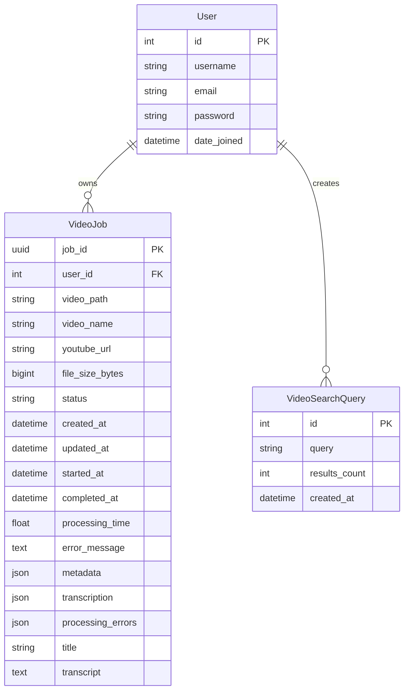
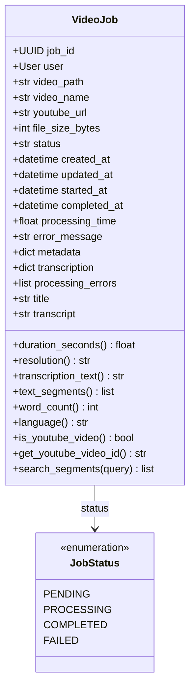
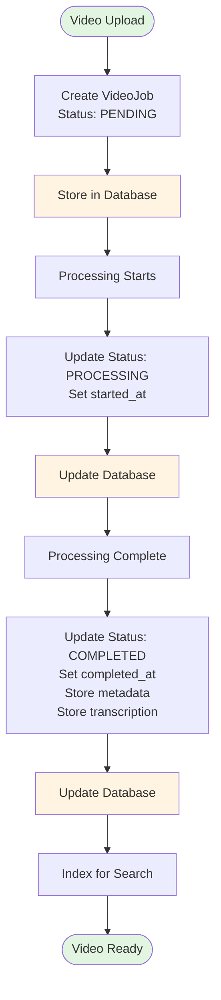
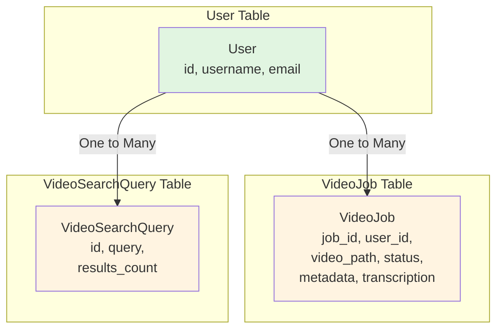
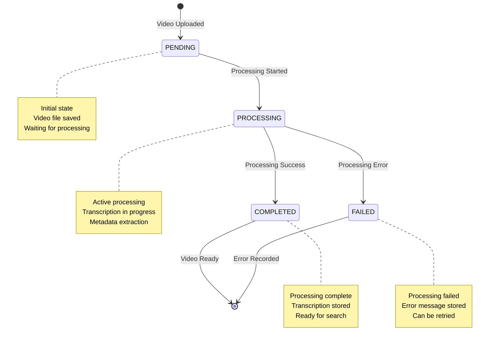
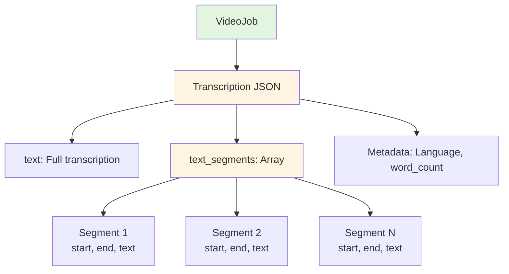
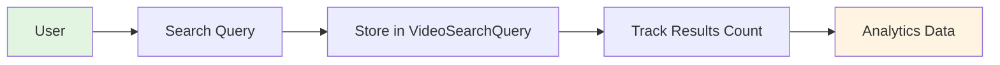

# Database Schema Diagram

## Entity Relationship Diagram

## VideoJob Model Structure

## Data Flow Through Database

## Database Relationships

## VideoJob Status Transitions

## Transcription Data Structure

## Search Query Tracking

