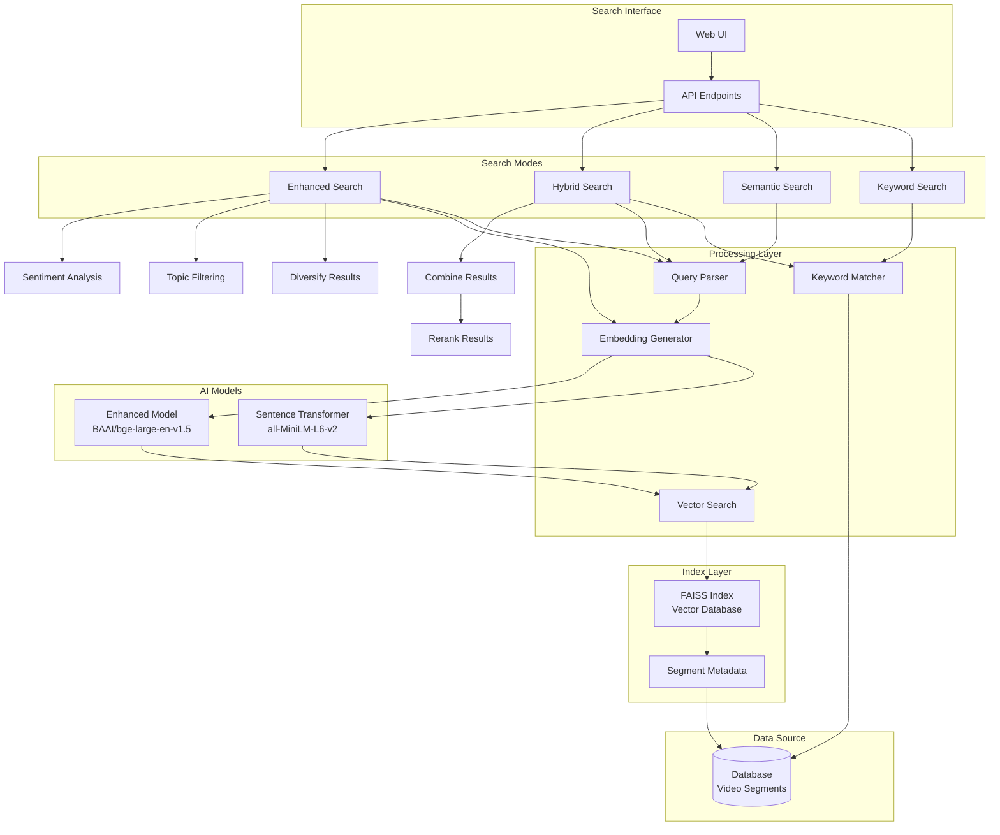
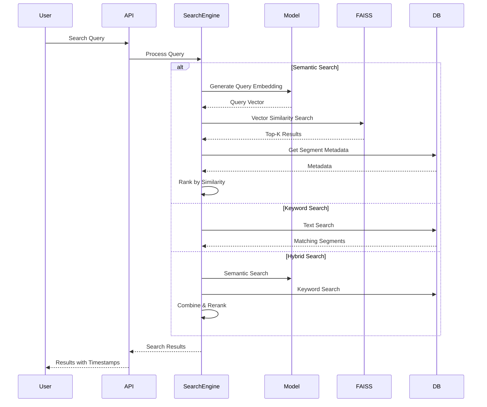
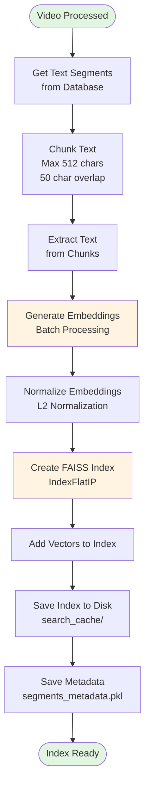
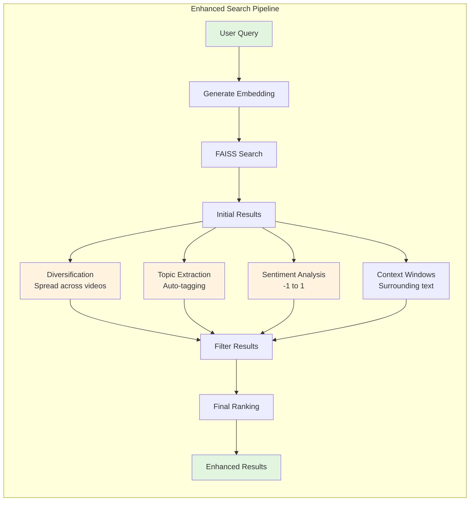
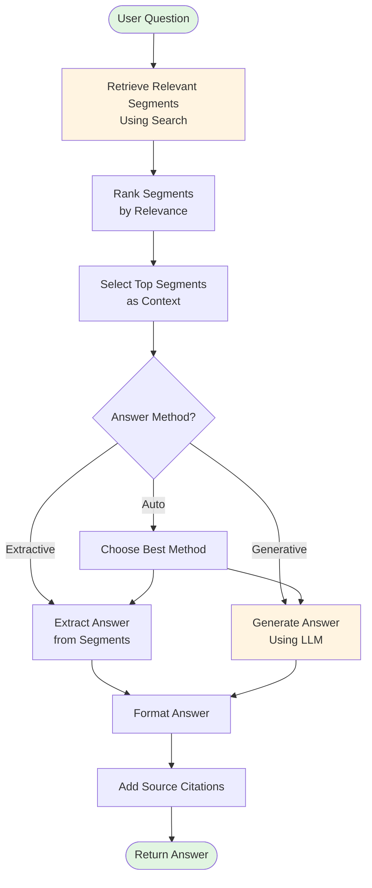

# Search System Architecture

## Search Engine Components

```mermaid
graph TB
    subgraph "Search Interface"
        WebUI[Web UI]
        API[API Endpoints]
    end
    
    subgraph "Search Modes"
        Keyword[Keyword Search]
        Semantic[Semantic Search]
        Hybrid[Hybrid Search]
        Enhanced[Enhanced Search]
    end
    
    subgraph "Processing Layer"
        QueryParser[Query Parser]
        EmbeddingGen[Embedding Generator]
        VectorSearch[Vector Search]
        KeywordMatch[Keyword Matcher]
    end
    
    subgraph "AI Models"
        STModel[Sentence Transformer<br/>all-MiniLM-L6-v2]
        EnhancedModel[Enhanced Model<br/>BAAI/bge-large-en-v1.5]
    end
    
    subgraph "Index Layer"
        FAISS[FAISS Index<br/>Vector Database]
        Metadata[Segment Metadata]
    end
    
    subgraph "Data Source"
        DB[(Database<br/>Video Segments)]
    end
    
    WebUI --> API
    API --> Keyword
    API --> Semantic
    API --> Hybrid
    API --> Enhanced
    
    Keyword --> KeywordMatch
    KeywordMatch --> DB
    
    Semantic --> QueryParser
    QueryParser --> EmbeddingGen
    EmbeddingGen --> STModel
    STModel --> VectorSearch
    VectorSearch --> FAISS
    FAISS --> Metadata
    
    Hybrid --> KeywordMatch
    Hybrid --> QueryParser
    Hybrid --> Combine[Combine Results]
    Combine --> Rerank[Rerank Results]
    
    Enhanced --> QueryParser
    Enhanced --> EmbeddingGen
    EmbeddingGen --> EnhancedModel
    EnhancedModel --> VectorSearch
    Enhanced --> Diversify[Diversify Results]
    Enhanced --> TopicFilter[Topic Filtering]
    Enhanced --> Sentiment[Sentiment Analysis]
    
    Metadata --> DB
```

## Semantic Search Process

```mermaid
sequenceDiagram
    participant User
    participant API
    participant SearchEngine
    participant Model
    participant FAISS
    participant DB
    
    User->>API: Search Query
    API->>SearchEngine: Process Query
    
    alt Semantic Search
        SearchEngine->>Model: Generate Query Embedding
        Model-->>SearchEngine: Query Vector
        SearchEngine->>FAISS: Vector Similarity Search
        FAISS-->>SearchEngine: Top-K Results
        SearchEngine->>DB: Get Segment Metadata
        DB-->>SearchEngine: Metadata
        SearchEngine->>SearchEngine: Rank by Similarity
    else Keyword Search
        SearchEngine->>DB: Text Search
        DB-->>SearchEngine: Matching Segments
    else Hybrid Search
        SearchEngine->>Model: Semantic Search
        SearchEngine->>DB: Keyword Search
        SearchEngine->>SearchEngine: Combine & Rerank
    end
    
    SearchEngine-->>API: Search Results
    API-->>User: Results with Timestamps
```

## Index Building Process

```mermaid
flowchart TD
    Start([Video Processed]) --> GetSegments[Get Text Segments<br/>from Database]
    GetSegments --> Chunk[Chunk Text<br/>Max 512 chars<br/>50 char overlap]
    Chunk --> ExtractText[Extract Text<br/>from Chunks]
    ExtractText --> GenerateEmbed[Generate Embeddings<br/>Batch Processing]
    GenerateEmbed --> Normalize[Normalize Embeddings<br/>L2 Normalization]
    Normalize --> CreateIndex[Create FAISS Index<br/>IndexFlatIP]
    CreateIndex --> AddVectors[Add Vectors to Index]
    AddVectors --> SaveIndex[Save Index to Disk<br/>search_cache/]
    SaveIndex --> SaveMeta[Save Metadata<br/>segments_metadata.pkl]
    SaveMeta --> Ready([Index Ready])
    
    style Start fill:#e1f5e1
    style Ready fill:#e1f5e1
    style GenerateEmbed fill:#fff4e1
    style CreateIndex fill:#fff4e1
```

## Enhanced Search Features

```mermaid
graph LR
    subgraph "Enhanced Search Pipeline"
        Query[User Query] --> Embed[Generate Embedding]
        Embed --> Search[FAISS Search]
        Search --> Results[Initial Results]
        
        Results --> Diversify[Diversification<br/>Spread across videos]
        Results --> Topic[Topic Extraction<br/>Auto-tagging]
        Results --> Sentiment[Sentiment Analysis<br/>-1 to 1]
        Results --> Context[Context Windows<br/>Surrounding text]
        
        Diversify --> Filter[Filter Results]
        Topic --> Filter
        Sentiment --> Filter
        Context --> Filter
        
        Filter --> Rank[Final Ranking]
        Rank --> Output[Enhanced Results]
    end
    
    style Query fill:#e1f5e1
    style Output fill:#e1f5e1
    style Diversify fill:#fff4e1
    style Topic fill:#fff4e1
    style Sentiment fill:#fff4e1
```

## RAG System Architecture

```mermaid
flowchart TD
    Start([User Question]) --> Retrieve[Retrieve Relevant Segments<br/>Using Search]
    Retrieve --> Rank[Rank Segments<br/>by Relevance]
    Rank --> Select[Select Top Segments<br/>as Context]
    Select --> CheckMethod{Answer Method?}
    
    CheckMethod -->|Extractive| Extract[Extract Answer<br/>from Segments]
    CheckMethod -->|Generative| Generate[Generate Answer<br/>Using LLM]
    CheckMethod -->|Auto| Auto[Choose Best Method]
    
    Auto --> Extract
    Auto --> Generate
    
    Extract --> Format[Format Answer]
    Generate --> Format
    Format --> AddSources[Add Source Citations]
    AddSources --> Return([Return Answer])
    
    style Start fill:#e1f5e1
    style Return fill:#e1f5e1
    style Retrieve fill:#fff4e1
    style Generate fill:#fff4e1
```

