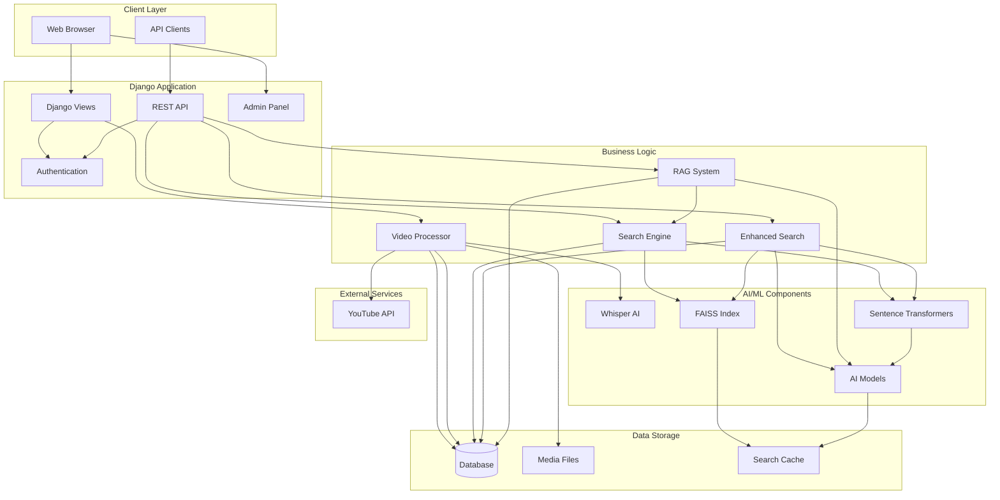
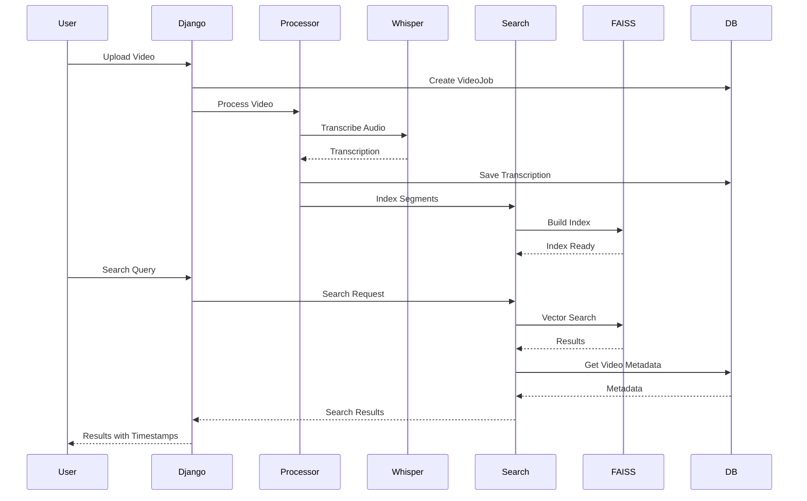

# System Architecture Diagram

## High-Level System Architecture

```mermaid
graph TB
    subgraph "Client Layer"
        Web[Web Browser]
        API_Client[API Clients]
    end
    
    subgraph "Django Application"
        Views[Django Views]
        API[REST API]
        Admin[Admin Panel]
        Auth[Authentication]
    end
    
    subgraph "Business Logic"
        VideoProcessor[Video Processor]
        SearchEngine[Search Engine]
        EnhancedSearch[Enhanced Search]
        RAG[RAG System]
    end
    
    subgraph "AI/ML Components"
        Whisper[Whisper AI]
        Embeddings[Sentence Transformers]
        FAISS[FAISS Index]
        Models[AI Models]
    end
    
    subgraph "Data Storage"
        DB[(Database)]
        Media[Media Files]
        Cache[Search Cache]
    end
    
    subgraph "External Services"
        YouTube[YouTube API]
    end
    
    Web --> Views
    Web --> Admin
    API_Client --> API
    Views --> Auth
    API --> Auth
    
    Views --> VideoProcessor
    API --> SearchEngine
    API --> EnhancedSearch
    API --> RAG
    
    VideoProcessor --> Whisper
    VideoProcessor --> Media
    VideoProcessor --> DB
    
    SearchEngine --> Embeddings
    SearchEngine --> FAISS
    EnhancedSearch --> Embeddings
    EnhancedSearch --> FAISS
    EnhancedSearch --> Models
    
    RAG --> SearchEngine
    RAG --> Models
    
    FAISS --> Cache
    Embeddings --> Models
    Models --> Cache
    
    VideoProcessor --> YouTube
    VideoProcessor --> DB
    SearchEngine --> DB
    EnhancedSearch --> DB
    RAG --> DB
```

## Component Interaction

```mermaid
sequenceDiagram
    participant User
    participant Django
    participant Processor
    participant Whisper
    participant Search
    participant FAISS
    participant DB
    
    User->>Django: Upload Video
    Django->>DB: Create VideoJob
    Django->>Processor: Process Video
    Processor->>Whisper: Transcribe Audio
    Whisper-->>Processor: Transcription
    Processor->>DB: Save Transcription
    Processor->>Search: Index Segments
    Search->>FAISS: Build Index
    FAISS-->>Search: Index Ready
    
    User->>Django: Search Query
    Django->>Search: Search Request
    Search->>FAISS: Vector Search
    FAISS-->>Search: Results
    Search->>DB: Get Video Metadata
    DB-->>Search: Metadata
    Search-->>Django: Search Results
    Django-->>User: Results with Timestamps
```

